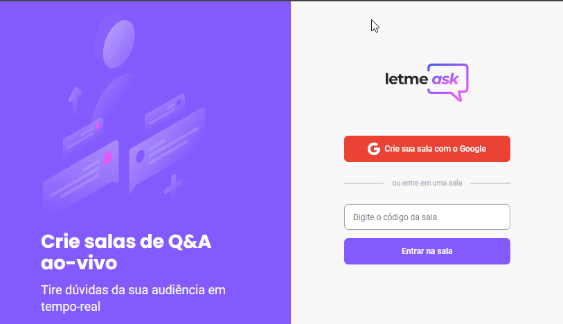
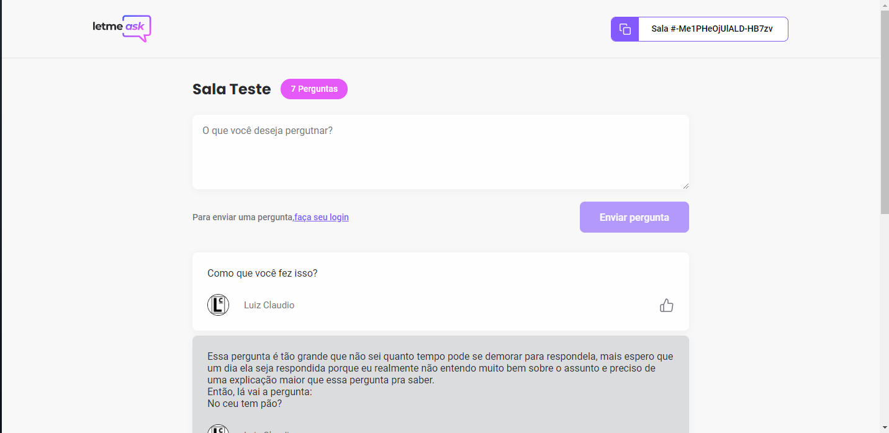
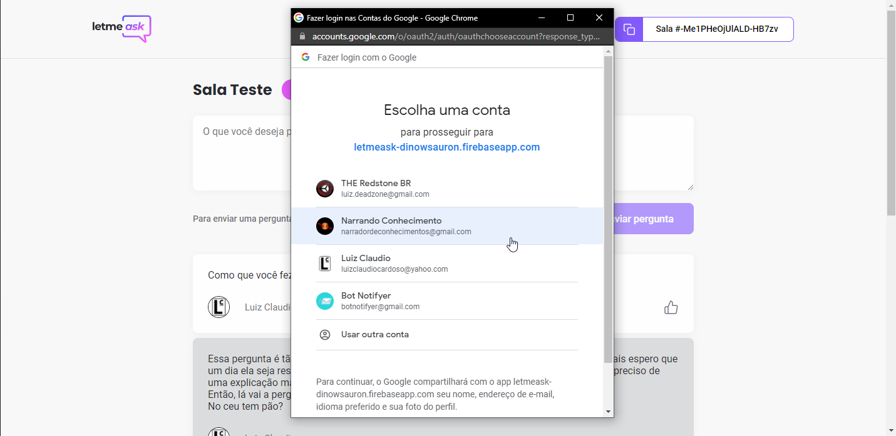
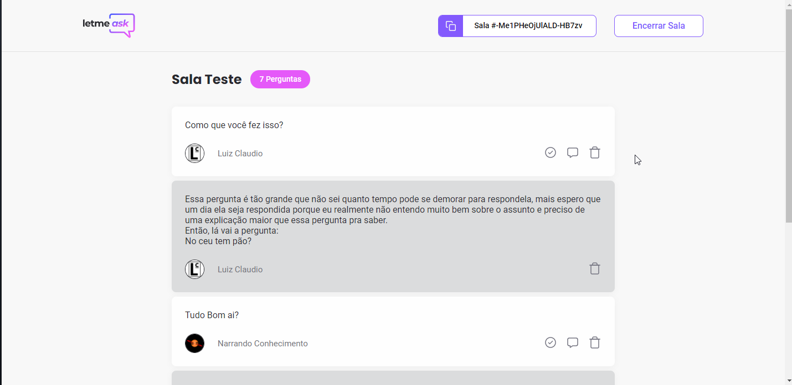
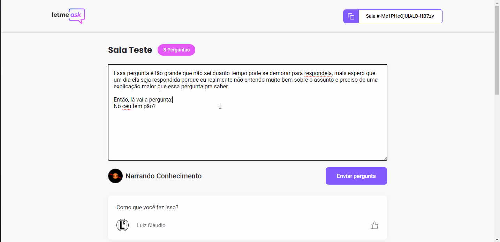
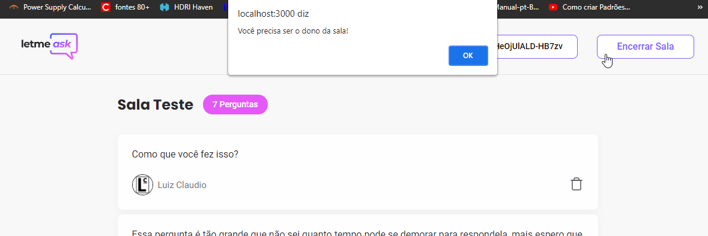
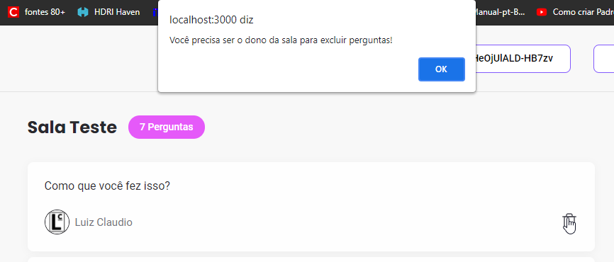

<h1 align="center">Projeto Next Level Week 6 (React JS)</h1>


<a href="https://github.com/DinowSauron/Projeto-Next-Level-Week-6-Together" title="letmeask" >
    <p align="center">
        
    </p>
</a>

<p align="center">
   <a href="#Como-Inicializar">Como Inicializar</a>&nbsp;&nbsp;&nbsp;|&nbsp;&nbsp;&nbsp;
   <a href="#Comandos-Utilizados">Comandos</a>&nbsp;&nbsp;&nbsp;|&nbsp;&nbsp;&nbsp;
   <a href="#Resolvendo-o-problema-de-segurança">Adicionando Verificação</a>&nbsp;&nbsp;&nbsp;|&nbsp;&nbsp;&nbsp;
   <a href="/LICENSE">Licença</a>
</p>

 O Projeto desta semana é o **Letmeask**!

 **Letmeask** é um aplicativo de perguntas e respostas, onde uma pessoa cria uma sala em tempo real e outras pessoas entram na sala e realizam suas perguntas para serem respondidas. Perfeito para gerenciamento de perguntas em massa durante eventos/live/shows/apresentações etc...

 Acesse o projeto e teste agora mesmo [Clicando Aqui!](https://letmeask-dinowsauron.web.app/rooms/join/-Me1PHeOjUlALD-HB7zv)


## Fotos Da Aplicação:


<a href="https://github.com/DinowSauron/Projeto-Next-Level-Week-6-Together" target="_blank">

    <p style="display: flex; margin-top: 20px" >
        
        
    </p>
    <p style="display: flex; margin-top: 20px">
        
        
    </p>  
</a>


<hr>

## Tecnologias Utilizadas:

* ReactJS
* Typescript
* HTML5
* SASS
* Firebase:
    * Autenticação.
    * Banco de dados em tempo real.
    * Hosting.
* SPA: Single Page Application


## Como Inicializar:

* Primeiramente, utilize seu CMD com o [**Yarn**](https://yarnpkg.com/) instalado.
* Instale as dependencias com ``yarn install``.
* Crie uma conta na google e inicie um projeto no [**Firebase**](https://firebase.google.com/?hl=pt).
* No firebase, crie um aplicativo web, permitindo login pelo google e banco de dados em tempo real.
* Tenha certeza de criar as [regras](#Regras-do-Firebase) corretas no banco de dados para permitir leitura/gravação.
* Crie um arquivo chamado ``.env.local`` e coloque as informações do app do firebase nestas variaveis:
    ```
    REACT_APP_API_KEY="xxxxx-xxxx"
    REACT_APP_AUTH_DOMAIN="xxxxxxx.firebaseapp.com"
    REACT_APP_DATABASE_URL="https://xxxxxxx-default-rtdb.firebaseio.com"
    REACT_APP_PROJECT_ID="xxxxx"
    REACT_APP_STORAGE_BUCKET="xxxxxx.appspot.com"
    REACT_APP_MESSAGING_SENDER_ID="0000000"
    REACT_APP_APP_ID="0:0000000000000:web:0x00000000xx00x0"
    ```
* Utilize o comando ``yarn start`` para abrir o site.
* Faça Login com uma conta do google para continuar.
* Host no Firebase:
    * ``yarn global add firebase-tools``
    * ``firebase login``
    * ``firebase init``
        * Hosting.
        * Realtime database.
        * Selecione o projeto.
            * What file should be used for Realtime Database Security Rules? ``database.rules.json``
            * What do you want to use as your public directory? ``build``
            * Configure as a single-page app (rewrite all urls to /index.html)? ``Yes``
        * ``yarn build``
        * ``firebase deploy``


---

## Notas Pessoais:

Neste nlw não tive muito tempo, pois ele conhecidiu com meus estudos para habilitação, porém não deixei de fazer o nlw.

Bastante coisa precisou de alterações, principalmente por erros comuns de formatação e alinhamentos, além de faltar ainda muita coisa a ser feita, já consegui resolver a maioria delas

Sei que é apenas um evento, nada de criar algo real, porém basta qualquer um ter a url de admin e ter uma conta logada(qualquer conta) pra se tornar um admin, qualquer um pode excluir qualquer pergunta, Não possuí nenhuma verificação antes de deletar a pergunta, porem possui verificação para dar like?

Além do highlight não ser removivel, da pergunta respondida não virar a ultima pergunta, o admin não sabe os likes da pergunta então não sabe qual priorizar, os likes não possuem efeito nenhum, não há organização, como a pergunta com highlight ficar por cima, as respondidas por baixo e as com mais likes ficaram no topo etc...

Não diria que o projeto está finalizado pelo fato de ainda estar faltando muita coisa, mais posso dizer que o evento foi concluído com sucesso!


Esta nlw não foi diferente, sempre com seus "erros" que até eu poderia resolver (e resolvo alguns).

### NOTES:
* www.api.github.com
* https://console.firebase.google.com/
    * https://firebase.google.com/pricing
* Spread operator JavaScript.
* React router dom.
* https://react-hot-toast.com
* Database Serverless:
    * AWS DynamoDB. (NoQSL)
    * FaunaDB.
    * Supabase. (Alternativo do Firebase)
* React: algoritimo de reconciliação.
* React Modal.
* Host do firebase apenas paginas estaticas! (HTML, CSS, JS)
* create react app deplyment / firebase.
* Criação PWA (Aplicativo).

- Para o projeto ser iniciado é necessário uma conta no firebase, logo depois uma configuração de um app web e as informaçoes precisam ser repassadas por um arquivo ``.env.local``  
- Cláro, não é um projeto final, ainda faltam muitas coisas, como log-out, verificar se o usuario deseja ter seu login lembrado, etc...


## Melhorias:

* Verificação do usuario(administrador) ao remover, marcar, responder perguntas e encerrar a sala. (Implementado).
* Administrador conseguir saber a pergunta mais votada.
* Classificação dos comentários.
* Remoção do highlight.
* Impedir entrar na sala fechada pela url.
* Remover pessoas da sala apos ela ser fechada.
* Excluir a sala fechada do banco de dados.
* Sistema de copiar o link da sala para o clipboard. (Implementado).
* Ao Criar sala, já entrar como administrador. (Implementado).
* Saber se tem alguém na sua sala, saber quantas pessoas logadas estão interagindo no app em sua sala.
* Administrador visualizar os likes.
* Sair da conta já logada.
* Responsividade.
* PWA
* 

---

## Comandos Utilizados:
OBS: note que não é um tutorial de como executar a aplicação, isto são os comandos anotados, claro que com eles você pode saber como executar a aplicação, basta ler oque cada comando executa.

<br>


* ``yarn create react-app letmeask --template typescript``
* ``cd letmeask``
* ``yarn add firebase``
* ``yarn start``
* ``yarn add node-sass@^5.0.0`` - *versão 6 não suportada*
* ``yarn add react-router-dom``
* ``yarn add @types/react-router-dom -D``

## Regras do Firebase:

```json
{
  "rules": {
    "rooms": {
      ".read": false,
      ".write": "auth != null",
      "$roomId": {
        ".read": true,
        ".write": "auth != null && (!data.exists() || data.child('authorId').val() == auth.id)",
        "questions": {
          ".read": true,
          ".write": "auth != null && (!data.exists() || data.parent().child('authorId').val() == auth.id)",
          "likes": {
            ".read": true,
            ".write": "auth != null && (!data.exists() || data.child('authorId').val() == auth.id)",
          }
        }
      }
    }
  }
}
```

## Resolvendo o problema de segurança:

OBS: continue caso você fez o evento e não solucionou o problema, pois no meu repositório eu jamáis daria upload com uma falha dessas, ou seja, se você deu clone, já possuí a versão onde o problema foi solucionado.

---

observe que no projeto original não há nenhum tipo de verificação se é o propietario da sala antes de deletar uma questão ou encerrar a sala.
```tsx
async function handleDeleteQuestion(questionId: string) {
        if (window.confirm("Tem certeza que deseja excluir esta pergunta?")) {
            await database.ref(`rooms/${roomId}/questions/${questionId}`).remove();
        }
    }
```

Para resolver isso é facíl, basta verificar se o Id do usuário logado é o mesmo do usuário que criou a sala... 


Então para resolver isso, crie uma variavel no useRoom.tsx:
``const [authorId, setAuthorId] = useState("");``

Certifique de colocar o authorId no return do ``parsedQuestions`` e setar o seu estado:
```tsx
roomRef.on("value", room => {
  const databaseRoom = room.val();
  const firebaseQuestions: FirebaseQuestions = databaseRoom.questions  ?? {};

  const parsedQuestions = Object.entries(firebaseQuestions).map(([key, value]) => {
      return {
          id: key,
          content: value.content,
          author: value.author,
          authorId: value.authorId, // <-
          isHighlighted: value.isHighlighted,
          isAnswered: value.isAnswered,
          likeCount: Object.values(value.likes ?? {}).length,
          likeId: Object.entries(value.likes ?? {}).find(([key, like]) => like.authorId === user?.id)?.[0],
      }
  });

  setAuthorId(databaseRoom.authorId); // <-
  setTitle(databaseRoom.title);
  setQuestions(parsedQuestions);
})
```

E também adicione na sua tipagem:
```tsx
type FirebaseQuestions = Record<string, {
    author: {
        name: string;
        avatar: string;
    }
    authorId: string; // <-
    content: string;
    isAnswered: boolean;
    isHighlighted: boolean;
    likes: Record<string, {
        authorId: string;
    }>;
}>;
```

Logo depois, exporte o authorId do useRoom:

``return {questions, title, authorId};``


Agora, no adminRoom é possível saber o id da conta que criou a sala, assim podendo ser possível uma verificação antes da remoção no banco de dados!

Certifique-se de importar o authorId no adminRoom:

``const { title, questions, authorId } = useRoom(roomId);``

Agora ao colocar-mos ``console.log(authorId === user?.id);`` podemos ver no console se você é o dono da sala!

porém não basta isso, temos que colocar na condição de deletar pergunta e sala...

Basta usar uma condição simples ``if( user?.id === authorId){}`` pronto! o que estiver ai dentro será executado se o seu Id for o mesmo ID do criador da sala, ou seja, se você for o dono da sala!

No codigo:

```tsx
 async function handleDeleteQuestion(questionId: string) {

        if( user?.id === authorId){ // <-
            if (window.confirm("Tem certeza que deseja excluir esta pergunta?")) {
                await database.ref(`rooms/${roomId}/questions/${questionId}`).remove();
            }
        } else {
            alert("Você precisa ser o dono da sala para excluir perguntas!");
        }
    }

    async function handleEndRoom() {

        if( user?.id === authorId){ // <-
            if (window.confirm("Tem certeza que deseja encerrar a sessão?")) {
                database.ref(`rooms/${roomId}`).update({
                    endedAt: new Date(),
                })
    
                history.push("/");
            }
        } else {
            alert("Você precisa ser o dono da sala para encerra-la!");
        }
    }
```
Agora, observe logar com outra conta e entrar no mesmo endereço Http do admin e tentar fazer alterações de administrador!
<p style="display: flex; margin-top: 20px">
  
  
</p>  

### Conclusão:

Não sei o porque não foi abordado algo tão simples de ser feito, e tão necessáro, diz o diego (executor do projeto) que as regras do banco de dados impede esse tipo de comportamento, mais só na teoria, pois ele nem ousou a testar para ver que não funciona...

Cláro que algo mais complexo pode ser feito, possívelmente poderiamos não deixar que o usuário entra-se na pagina e já redireciona ele pra pagina inicial ao ele tentar entrar como admin em uma sala que não seja sua...

---


## Licença:
Note que este projeto está sob a licensa MIT. Veja o arquivo para mais detalhes: <a href="/LICENSE">LICENSE</a>

